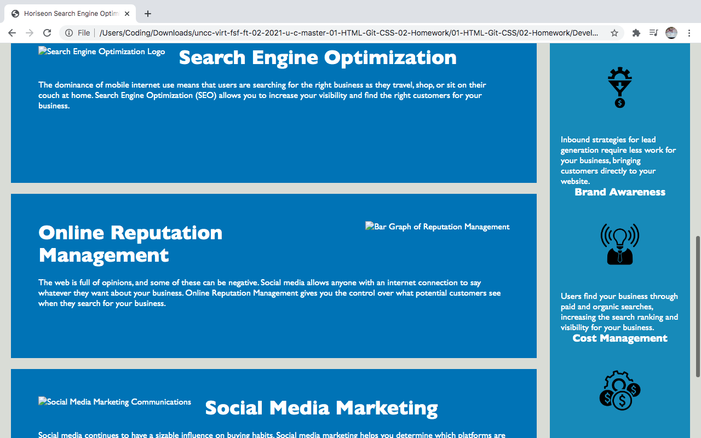

# Horiseon Code Refactor

## Description
A revision of Horiseon's website site to add more accessibility

 A modification of a Search Engine Optimization Website I created alt text for the various pictures to be read by screen readers, added semantic elements to clean up the source code,revised the elements in a good structure that can be understood. I have included the reworked work elements added to the webpage.

 In doing the project I learned various techniques on coding, the importance of alt tags and their purposes. My motivation for creation was to make a efficent website to suit those was ascessibility needs.

......

### Screenshots of Rework

  
[Link to Webpage](https://basedmilz.github.io/Horiseon-Refactor/)
[Link to Repository](https://github.com/basedmilz/Horiseon-Refactor)